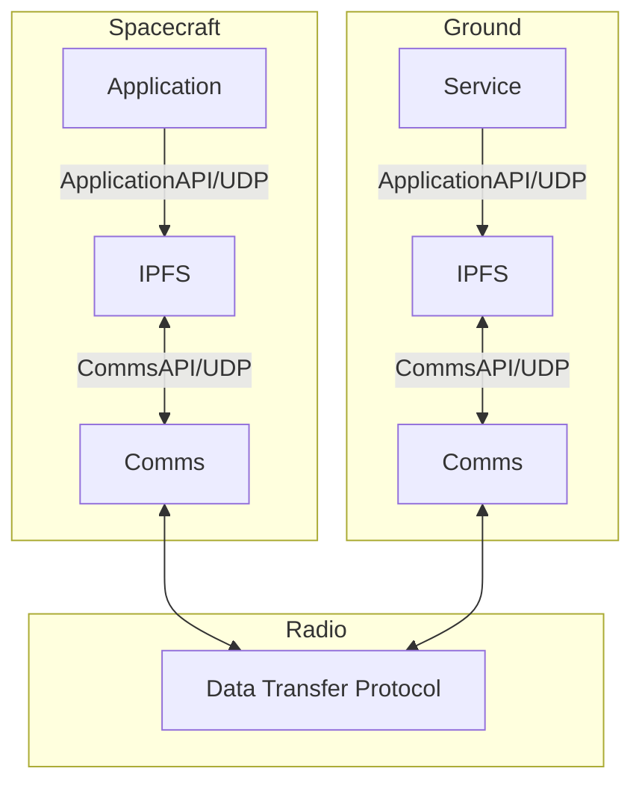
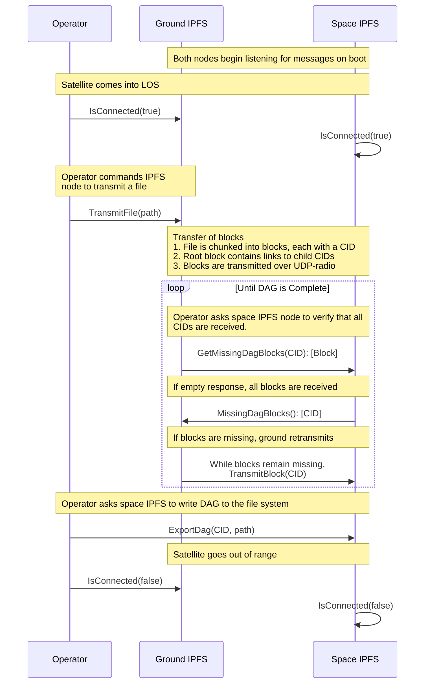
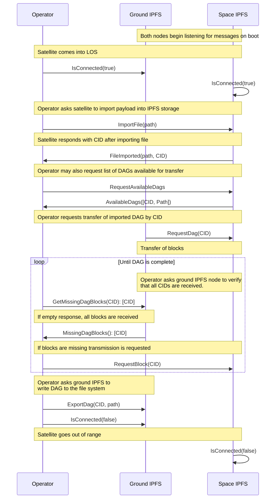

# Space

## Overview

This project is focusing on applying content-addressable data & tooling to satellite communications. This is one part engineering project and one part science experiment. The overall goal is to provide a well engineered path for using pieces of IPFS, starting with content-addressable data, in the space communications context. After this has been built, a data-driven comparison must be made against existing data communications/transfer protocols. Quantifiable data must be collected for a fair comparison with existing data transfer protocols. The experimental setup will provide a structure for building up the engineered product, which will then be run through “experiments”, or test runs, to collect performance metrics.

The work and communications for this project will be coordinated through the [ipfs-shipyard/space repo](https://github.com/ipfs-shipyard/space) and the [Filecoin #space channel](https://filecoinproject.slack.com/archives/C02N7M67FKK).

### MVPs

- [x] [v0.1 - Generate & transmit CAR over radio](https://github.com/ipfs-shipyard/space/issues/5)
- [x] [v0.2 - Generate DAG, transmit & receive over Radio](https://github.com/ipfs-shipyard/space/pull/15)
- [ ] v0.3 - Transmit & receive triggered by application API
- [ ] v0.4 - IPFS storage, CID advertisements and requests
- [ ] v0.5 - Block validation and CID validation APIs
- [ ] v0.6 - Pass-aware data transfer protocol
- [ ] v0.7 - Block and chunk requests and re-transmissions

A more detailed roadmap can be found [here](https://github.com/ipfs-shipyard/space/blob/main/ROADMAP.md).

## Objectives

1. Demonstrate the utility of content addressable protocols in the context of space-to-ground and space-to-space communications.
    - Provide a functional SDK for using content addressable protocols in aerospace context.
1. Provide the data required to accurately compare content addressable protocols to existing data transfer protocols.
    - Provide the tooling necessary to generate said data in real-life and simulated scenarios.

## Hypothesis

Content addressable protocols, such as those embedded in IPFS/IPLD, can provide enhanced reliability and verifiability in space-to-ground communications.

## Experiments

There are two experimental setups and scenarios which will be used in this project.

The first experimental setup addresses space-to-ground communications and consists of one satellite and N ground stations. All ground stations are assumed to be in contact with each other, whether by a private network, or access to the public internet. This assumption is drawn from the usage of IPFS between ground stations, which requires some kind of inter-station connection. The satellite will have communications with each ground station separately for X minutes each hour, or each pass. This requirement is in place to approximate expected communication patterns common to satellites. Each experiment run will see the satellite transmitting a payload of known size to the ground stations across the passes until the payload can be reassembled and verified. 

The second experimental setup addresses space-to-space communications and consists of N satellites and one ground station. All satellites are assumed to be in contact with each other via radio. Only one satellite is assumed to be in contact with the ground station at any given time. These requirements are in place to simulate the situation where one or more satellites are used to pass data along from the ground to a satellite which cannot contact a ground station. Each experiment run will consist of the ground station transmitting a payload of known size to the one satellite it can contact, and then that satellite will transmit the data to a different satellite for reassembly and verification.

The development/lab hardware setup for these experiments will consist of one or more Raspberry Pi 4s as the “satellites” and a desktop/laptop as the “ground station”, with a packet radio interface acting as the communications medium. The purpose of the development hardware is to provide an approximation of the target hardware platforms so that this project can develop helpful abstractions, particularly around the radio/communications interface.

Here is a list of the exact hardware pieces used for local development:
- "Satellite"
    - [Raspberry Pi 4](https://www.raspberrypi.com/products/raspberry-pi-4-model-b/)
    - [RFM69-based packet radio for raspberry pi](https://www.adafruit.com/product/4072)

- "Ground Station"
    - Laptop or Desktop running Linux or MacOS
    - [RFM69-based packet radio with USB interface](https://www.adafruit.com/product/3076)

### Tunable parameters under study:
- Number of ground stations
- Length of passes
- Passes overlapping (or not)
- Size of payload
- Size of blocks payload is broken down into
- Format of content addressable data (CAR, raw, etc)
- Speed of transmission in-pass

### Metrics to measure:
- Verification/reassembly pass or fail
- Total time from beginning of transmission to verified reassembly on ground
- Total number of passes required
- Min/max/mean number of total transmissions per block
- Min/max/mean number of block transmissions duplicated across ground stations

## Environmental Assumptions

These are assumptions we are establishing to 1) limit scope and 2) establish reasonable constraints:

- Satellites already have an established communications path to their ground stations. 
- Security or encryption is the responsibility of the satellite and already baked into their communications protocols, which we will operate under.
- Memory will be a more scarce resource than storage, and likely order(s) of magnitude less than in typical desktop/cloud computing systems.

## Architecture Overview

This is an overview of the different pieces of software which will be built and which are assumed to exist in the target environments:

* Interfaces
    * Application API - An API provided by the IPFS processes to allow it to be commanded by local processes either onboard spacecraft or in a ground station. This will be a network API using UDP packets sent either over the local network or the communications link.
    * Communications API - An API provided by the IPFS process for integration with communications links either onboard spacecraft or in a ground station. The IPFS side of this API will be a network API using UDP packets. The system side will essentially be a comms to UDP translation layer.
    * Data Transfer Protocol - A protocol used by IPFS processes on spacecraft and ground to handle the transfer of files in DAG blocks form. This will logically do what BitSwap does, but BitSwap will not be used.

* Spacecraft
    * IPFS - A modified IPFS instance tailored for the spacecraft environment with the functionality required to facilitate content-addressable data exchanges.
    * Application - Each spacecraft is expected to have onboard applications or services which will interact with the IPFS process via the `Application API` to perform functions such as _"store a file in IPFS"_ or _"transmit a CID to ground"_.
    * Comms - Each spacecraft is expected to have a communications link with an existing interface, which IPFS will communicate over using the `Communications API`.

* Ground
    * IPFS - A modified IPFS instance tailored for the ground station environment, which is able to communicate with the space-bound IPFS instance, and possibly also bridge with other public/private IPFS networks.
    * Service - Ground stations are expected to have services or applications which will command the IPFS process via the `Application API` to perform functions such as _"store and upload a file"_ or _"request a CID from space"_.
    * Comms - Each ground station is expected to have a communication link with an existing interface, which IPFS will communicate over using the `Communications API`.

## Usage Diagrams

Here are a few different scenarios this system is expected to perform in and diagrams demonstrating how the various control messages will be used.

### Ground to Space in single pass

In this scenario ground wants to transmit a file to the satellite over IPFS. This describes transmitting a single file and is applicable to both single and multi-pass scenarios.

### Space to Ground in a single pass

In this scenario the satellite has a file that the ground station would like transmitted down. This describes transmitting a single file and is applicable to both single and multi-pass scenarios. It also illustrates explicitly loading the file into IPFS storage before transmitting.

## Meeting Notes

* [2/21/2023](meetings/2023-02-21.md)
* [2/13/2023](meetings/2023-02-13.md)
* [2/6/2023](meetings/2023-02-06.md)
* [11/14/2022](meetings/2022-11-14.md)
* [1/26/2023](meetings/2023-01-26.md)