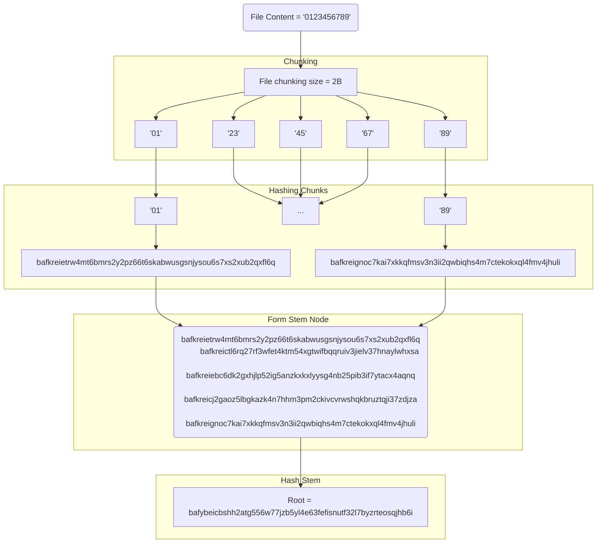

```mermaid
flowchart TD
    FC("File Content = '0123456789'")
    CZ["File chunking size = 2B"]
    FC --> CZ
    subgraph Chunking
        A["'01'"]
        B["'23'"]
        C["'45'"]
        D["'67'"]
        E["'89'"]
        CZ --> A
        CZ --> B
        CZ --> C
        CZ --> D
        CZ --> E
    end
    subgraph Hashing Chunks
        AA["'01'"] --> AH["bafkreietrw4mt6bmrs2y2pz66t6skabwusgsnjysou6s7xs2xub2qxfl6q"]
        EP["..."]
        EE["'89'"] --> EH["bafkreignoc7kai7xkkqfmsv3n3ii2qwbiqhs4m7ctekokxql4fmv4jhuli"]
        A --> AA
        B --> EP
        C --> EP
        D --> EP
        E --> EE 
    end
    subgraph Form Stem Node
        LT("bafkreietrw4mt6bmrs2y2pz66t6skabwusgsnjysou6s7xs2xub2qxfl6q
        bafkreictl6rq27rf3wfet4ktm54xgtwifbqqruiv3jielv37hnaylwhxsa
        bafkreiebc6dk2gxhjlp52ig5anzkxkxlyysg4nb25pib3if7ytacx4aqnq
        bafkreicj2gaoz5lbgkazk4n7hhm3pm2ckivcvrwshqkbruztqji37zdjza
        bafkreignoc7kai7xkkqfmsv3n3ii2qwbiqhs4m7ctekokxql4fmv4jhuli")
        AH --> LT
        EH --> LT
    end
    subgraph Hash Stem
        RT["Root = bafybeicbshh2atg556w77jzb5yl4e63fefisnutf32l7byzrteosqjhb6i"]
        LT-->RT
    end
```
