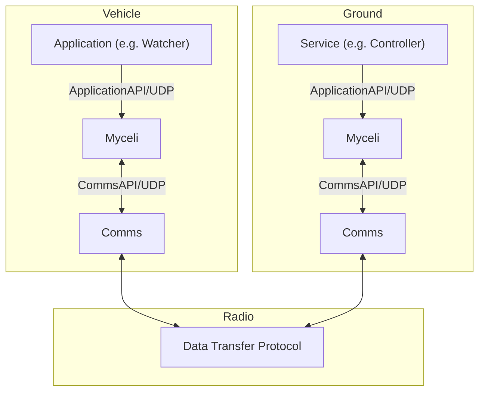

```mermaid
flowchart TD
    subgraph Vehicle
        A["Application (e.g. Watcher)"] -- ApplicationAPI/UDP --> B[Myceli]
        B <-- CommsAPI/UDP --> C[Comms]
    end

    subgraph Radio
        Z[Data Transfer Protocol]
    end

    subgraph Ground
        F["Service (e.g. Controller)"] -- ApplicationAPI/UDP --> E[Myceli]
        E <-- CommsAPI/UDP --> G[Comms]
    end

    C <--> Z
    G <--> Z
```
