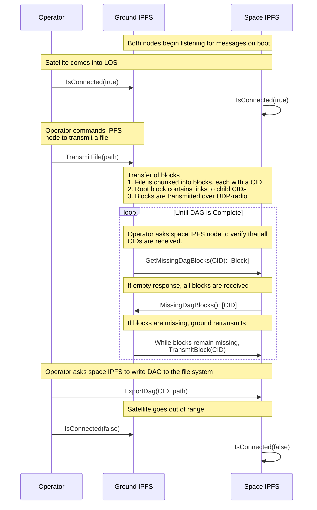

```mermaid
%%{init: { "sequence": { "noteAlign": "left"} } }%%

sequenceDiagram
    participant O as Operator
    participant G as Ground IPFS
    participant S as Space IPFS
    Note over G,S: Both nodes begin listening for messages on boot
    Note over O,S: Satellite comes into LOS
    O->>G: IsConnected(true)
    S->>S: IsConnected(true)
    Note over O,G: Operator commands IPFS <br/> node to transmit a file
    O->>G: TransmitFile(path)
    Note over G,S: Transfer of blocks <br/> 1. File is chunked into blocks, each with a CID <br/> 2. Root block contains links to child CIDs <br/> 3. Blocks are transmitted over UDP-radio 
    loop Until DAG is Complete
        Note over G,S: Operator asks space IPFS node to verify that all <br/> CIDs are received.
        G->>S: GetMissingDagBlocks(CID): [Block] <br/> 
        Note over G,S: If empty response, all blocks are received
        S->>G: MissingDagBlocks(): [CID]
        Note over G,S: If blocks are missing, ground retransmits
        G->>S: While blocks remain missing, <br/>TransmitBlock(CID)
    end
    Note over O,S: Operator asks space IPFS to write DAG to the file system
    O->>S: ExportDag(CID, path)
    Note over G,S: Satellite goes out of range
    O->>G: IsConnected(false)
    S->>S: IsConnected(false)
```