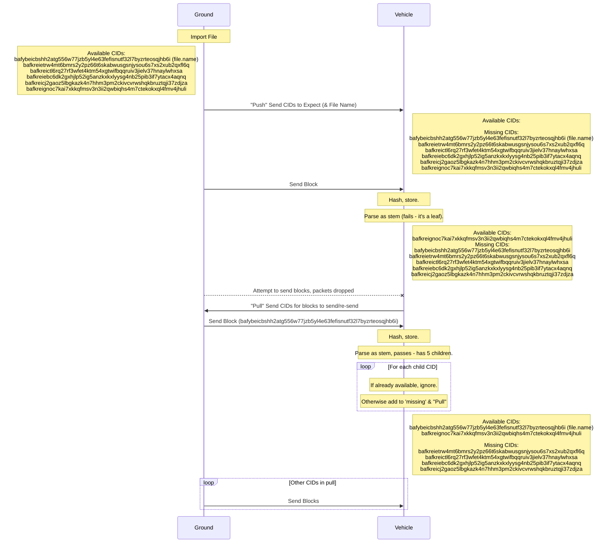

```mermaid
sequenceDiagram
    participant G as Ground
    participant V as Vehicle
    Note over G: Import File
    Note left of G: Available CIDs: <br /> bafybeicbshh2atg556w77jzb5yl4e63fefisnutf32l7byzrteosqjhb6i (file.name) <br /> bafkreietrw4mt6bmrs2y2pz66t6skabwusgsnjysou6s7xs2xub2qxfl6q <br/> bafkreictl6rq27rf3wfet4ktm54xgtwifbqqruiv3jielv37hnaylwhxsa <br/> bafkreiebc6dk2gxhjlp52ig5anzkxkxlyysg4nb25pib3if7ytacx4aqnq <br /> bafkreicj2gaoz5lbgkazk4n7hhm3pm2ckivcvrwshqkbruztqji37zdjza <br /> bafkreignoc7kai7xkkqfmsv3n3ii2qwbiqhs4m7ctekokxql4fmv4jhuli
    G ->> V: "Push" Send CIDs to Expect (& File Name)
    Note right of V: Available CIDs: <br /><br/> Missing CIDs: <br /> bafybeicbshh2atg556w77jzb5yl4e63fefisnutf32l7byzrteosqjhb6i (file.name) <br /> bafkreietrw4mt6bmrs2y2pz66t6skabwusgsnjysou6s7xs2xub2qxfl6q <br/> bafkreictl6rq27rf3wfet4ktm54xgtwifbqqruiv3jielv37hnaylwhxsa <br/> bafkreiebc6dk2gxhjlp52ig5anzkxkxlyysg4nb25pib3if7ytacx4aqnq <br /> bafkreicj2gaoz5lbgkazk4n7hhm3pm2ckivcvrwshqkbruztqji37zdjza <br /> bafkreignoc7kai7xkkqfmsv3n3ii2qwbiqhs4m7ctekokxql4fmv4jhuli
    G ->> V: Send Block
    Note over V: Hash, store.
    Note over V: Parse as stem (fails - it's a leaf). 
    Note right of V: Available CIDs: <br /> bafkreignoc7kai7xkkqfmsv3n3ii2qwbiqhs4m7ctekokxql4fmv4jhuli <br /> Missing CIDs: <br /> bafybeicbshh2atg556w77jzb5yl4e63fefisnutf32l7byzrteosqjhb6i <br /> bafkreietrw4mt6bmrs2y2pz66t6skabwusgsnjysou6s7xs2xub2qxfl6q <br/> bafkreictl6rq27rf3wfet4ktm54xgtwifbqqruiv3jielv37hnaylwhxsa <br/> bafkreiebc6dk2gxhjlp52ig5anzkxkxlyysg4nb25pib3if7ytacx4aqnq <br /> bafkreicj2gaoz5lbgkazk4n7hhm3pm2ckivcvrwshqkbruztqji37zdjza
    G --X V: Attempt to send blocks, packets dropped 
    V ->> G: "Pull" Send CIDs for blocks to send/re-send
    G ->> V: Send Block (bafybeicbshh2atg556w77jzb5yl4e63fefisnutf32l7byzrteosqjhb6i)
    Note over V: Hash, store.
    Note over V: Parse as stem, passes - has 5 children. 
    loop For each child CID
        Note over V: If already available, ignore.
        Note over V: Otherwise add to 'missing' & "Pull"
    end
    Note right of V: Available CIDs: <br /> bafybeicbshh2atg556w77jzb5yl4e63fefisnutf32l7byzrteosqjhb6i (file.name) <br /> bafkreignoc7kai7xkkqfmsv3n3ii2qwbiqhs4m7ctekokxql4fmv4jhuli <br /><br /> Missing CIDs: <br /> bafkreietrw4mt6bmrs2y2pz66t6skabwusgsnjysou6s7xs2xub2qxfl6q <br/> bafkreictl6rq27rf3wfet4ktm54xgtwifbqqruiv3jielv37hnaylwhxsa <br/> bafkreiebc6dk2gxhjlp52ig5anzkxkxlyysg4nb25pib3if7ytacx4aqnq <br /> bafkreicj2gaoz5lbgkazk4n7hhm3pm2ckivcvrwshqkbruztqji37zdjza
    loop Other CIDs in pull
        G ->> V: Send Blocks
    End
```
