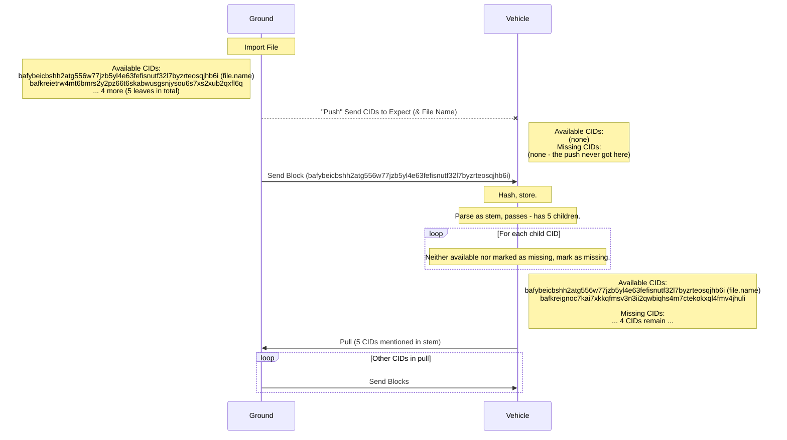

```mermaid
sequenceDiagram
    participant G as Ground
    participant V as Vehicle
    Note over G: Import File
    Note left of G: Available CIDs: <br /> bafybeicbshh2atg556w77jzb5yl4e63fefisnutf32l7byzrteosqjhb6i (file.name) <br /> bafkreietrw4mt6bmrs2y2pz66t6skabwusgsnjysou6s7xs2xub2qxfl6q <br/> ... 4 more (5 leaves in total)
    G --X V: "Push" Send CIDs to Expect (& File Name)
    Note right of V: Available CIDs: <br />(none)<br/> Missing CIDs: <br /> (none - the push never got here)
    G ->> V: Send Block (bafybeicbshh2atg556w77jzb5yl4e63fefisnutf32l7byzrteosqjhb6i)
    Note over V: Hash, store.
    Note over V: Parse as stem, passes - has 5 children. 
    loop For each child CID
        Note over V: Neither available nor marked as missing, mark as missing.
    end
    Note right of V: Available CIDs: <br /> bafybeicbshh2atg556w77jzb5yl4e63fefisnutf32l7byzrteosqjhb6i (file.name) <br /> bafkreignoc7kai7xkkqfmsv3n3ii2qwbiqhs4m7ctekokxql4fmv4jhuli <br /><br /> Missing CIDs: <br /> ... 4 CIDs remain ...
    V ->> G: Pull (5 CIDs mentioned in stem)
    loop Other CIDs in pull
        G ->> V: Send Blocks
    End
```